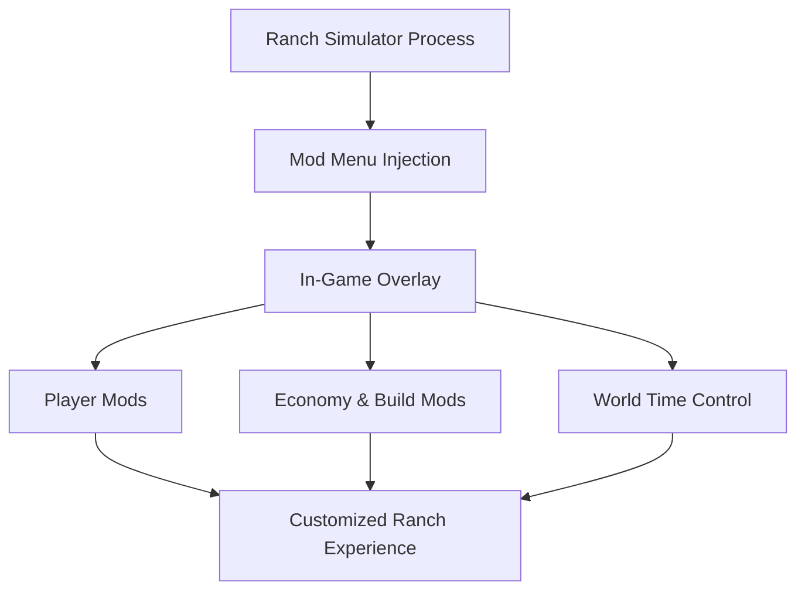

# Ranch Simulator Mod Menu

Ranch Simulator is a slow conversation with land and weather.
Boards creak. Engines idle. The sun takes its time.
**Ranch Simulator Mod Menu** slips quietly into that rhythm — not to break it, but to *give you the reins*.

This is not about rushing the ranch.
It’s about letting the ranch breathe the way *you* want it to.

---

## 🌤 Overview

The Mod Menu is a **live in-game overlay** that opens a sandbox of control inside Ranch Simulator. With sliders, toggles, and instant switches, you can reshape comfort, economy, and progression on the fly — no restarts, no permanent save edits.

One evening you grind honestly.
The next, you build freely and dream bigger.

Both belong here.

---

## 🧩 Mod Menu Features

### ❤️ Player Comfort & Survival

* God Mode / infinite health
* Infinite stamina
* Disable hunger & thirst
* Adjustable movement speed

### 💰 Economy Control

* Infinite money
* Lock current money value
* Free purchases
* Sell items without limits

### 🏗 Building & Construction

* Instant building completion
* No material requirements
* Free upgrades
* Skip construction timers

### 🐄 World & Utility Tweaks

* Time control (pause, slow, speed up)
* Freeze time of day
* Infinite vehicle fuel
* Tool & equipment durability lock

[!NOTE]
Every toggle is independent. You shape the ranch — not the other way around.

---

## ⚡ How It Feels to Use

1. Launch Ranch Simulator
2. Inject the Mod Menu
3. Open the overlay with a hotkey
4. Toggle features instantly
5. Adjust sliders live while playing

Example “creative build day” setup:

```text
• Infinite stamina
• Infinite money
• Instant construction
• Time slowed slightly
→ Calm, uninterrupted ranch planning
```

[!IMPORTANT]
For large layout experiments, start a fresh save so creativity stays intentional.

---

## 🔁 System Flow



Immediate feedback. Gentle control. No disruption.

---

## ❓ FAQ

**Is this different from a trainer?**
Yes. The Mod Menu stays open in-game with sliders and switches.

**Can I toggle mods while building or driving?**
Yes — everything works live.

**Will my save file break?**
No. Changes apply only in memory.

**Is it meant to remove all challenge?**
Only if you want it to. Most players use it to reduce grind.

**Does it work with controllers?**
Yes. It doesn’t interfere with controller input.

---

## 🌄 Final Thoughts

Ranch Simulator isn’t about winning.
It’s about *staying*.

This Mod Menu doesn’t replace that feeling — it clears the fog around it. Less fatigue. Less repetition. More room for imagination.

Build when inspiration hits.
Rest when the sun dips low.
And let the ranch become a place of choice, not obligation.

---
